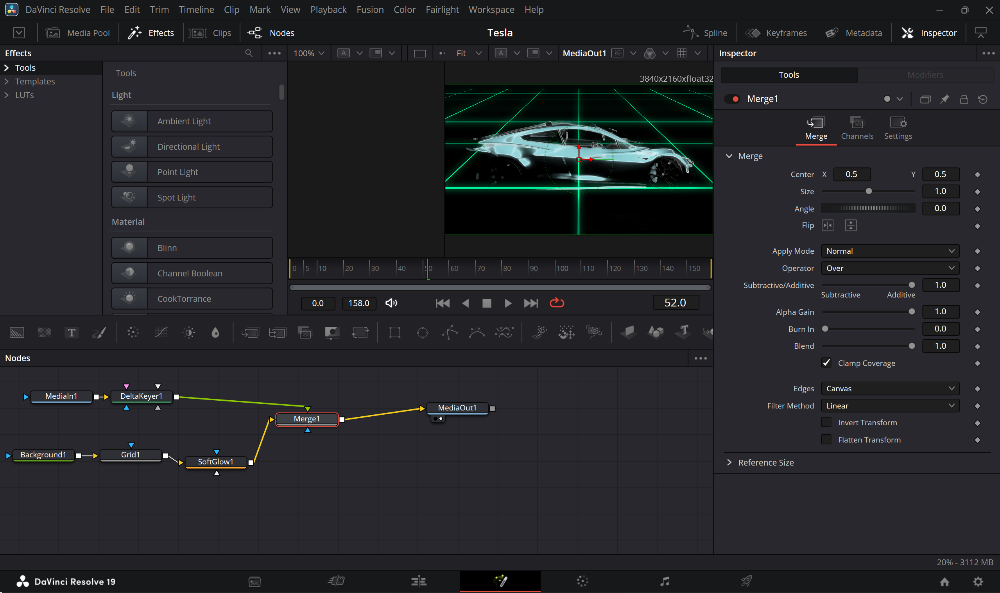

# 🚗 Tesla Performance Dashboard (Power BI)

A cinematic, KPI‑driven Tesla performance dashboard built entirely from scratch — combining **data storytelling**, **custom 3D visuals**, and **Power BI interactivity**.  
This project blends my skills in **data visualization** and **video editing** to create a dashboard that feels like a Tesla product launch.

---

## 📖 Project Story

This was my **second Power BI dashboard**, and I wanted to push beyond standard charts and KPIs.  
I set myself two creative challenges:  

1. **Build the dataset from scratch**  
   - I used a Python script (`tesla.py`) with ChatGPT’s help to generate a realistic Tesla performance dataset (`tesla_futuristic_dashboard.csv`).  
   - The data covers multiple years, models, and performance metrics.

2. **Integrate a cinematic 3D Tesla visual**  
   - I downloaded a Tesla Roadster 2020 video from YouTube (`tesla-roadster-2020-3d-model.mp4`).  
   - Using **DaVinci Resolve**, I transformed it into a custom 3D visual (`tesla-3d-visuals.mp4`).  
   - I then converted that MP4 into a GIF (`tesla-3d-visuals.gif`) for smooth embedding in the dashboard and README.  
   - This visual became the **hero element** of Page 1, set against a custom monochrome digital grid background (`monochrome-digital-grid.avif`).

> **Note on Page 2:**  
> The `.pbix` file contains a Page 2, but it was not created by me. It appears to be a blank or placeholder page automatically generated when I first set up the file. Since my focus was entirely on crafting a polished, cinematic Page 1, I left Page 2 untouched.

The result is a dashboard that merges **analytics** with **artistry**, making the data feel alive.

---

## 🖼 Preview

**Dashboard Overview (Page 1)**  

**Custom 3D Tesla Visual (GIF)**  

**DaVinci Resolve Project Screenshot**  

---

## 📊 Features

- **Executive Summary KPIs** — Revenue, Profit, Units Sold, Market Share, each with YoY% change.
- **Trend Analysis** — Multi‑year revenue and deliveries visualized with clean, Tesla‑inspired styling.
- **Custom Media Integration** — 3D Tesla visual embedded directly into the dashboard.
- **Branded UI** — Tesla red, black, and metallic gray palette with a digital grid background.
- **From‑Scratch Dataset** — Generated via Python and ChatGPT for full creative control.

---

## 🗂 File Structure

